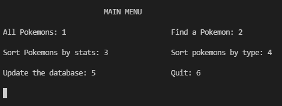
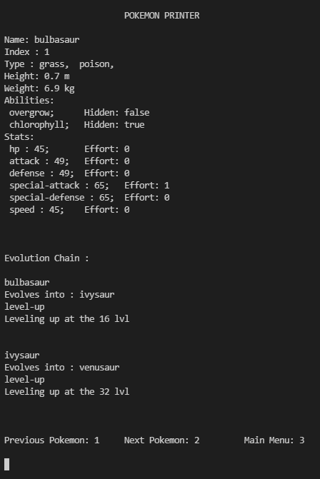

# __Pokedex__

Le __Pokedex__ est un programme basé sur __[l'API pokémon](https://pokeapi.co/)__ permettant de naviguer parmi la liste de tous les pokémons.

Le programme est un menu dans le terminal divisé en plusieures sections permettant d'accéder à plusieurs fonctionnalités différentes.

### __Les Différents Menus__ :

- `All Pokemons` : Menu permettant de naviguer parmi tous les Pokémon un par un.
- `Find a Pokemon` : Menu permettant rechercher un pokémon par son __nom__ (en anglais) ou son __index__.
- `Sort Pokémons by stats` : Menu permettant de trier les pokémons selon une de leurs statistiques (hp, attack, defense, special-attack, special-defense, speed). Le tri peut être choisi comme croissant ou décroissant.
- `Sort pokemons by type` : Menu permettant de trier les pokémons selon un de leurs types (Normal, Fighting, Flying, Poison, Ground, Rock, Bug, Ghost, Steel, Fire, Water, Grass, Electric, Psychic, Ice, Dragon, Dark, Fairy) dans une génération.
- `Update the database` : Menu permettant de mettre à jour les jsons de l'API téléchargés en local.

### __L'utilisation de l'API__ :

L'API est divisées en plusieures parties nous n'en utilisons que 3 :
- [pokemon/id](https://pokeapi.co/api/v2/pokemon/1) : Json qui permet d'accéder aux informations principales d'un pokémon (Nom, index, taille, poids stats, Sprites).
- [pokemon-species/id](https://pokeapi.co/api/v2/pokemon-species/1) : Json qui permet d'acceder à la chaine d'évolution du pokémon (et autres information non utilisées comme la description du pokémon).
- [evolution-chain/](https://pokeapi.co/api/v2/evolution-chain/1) : Json contenant tout les détails de la chaine d'évolutions de ce pokémon (évolution, niveau requis pour évoluer, objet requis, lieu requis ...)

_tout les liens utilisé dans l'exemple ramènent vers le premier pokémon et ses évolutions_

Le programme utilise les extern crate suivantes :

- [Reqwest](https://github.com/seanmonstar/reqwest) pour exécuter des requêtes HTTP et récupérer le contenu de pages web.
- [Serde JSON](https://github.com/serde-rs/json) pour télécharger les Jsons de l'API et les utiliser dans les structures pokémons.
- [indicatif](https://github.com/console-rs/indicatif) pour afficher une barre de progression lors de la mise à jour des __Json__

Amélioration à envisager :

- Utiliser les Sprites dans une interface graphique.
- Ajouter les descriptions des pokémons.
- Réorganiser le code en plusieurs fichiers pour une meilleure lisibilité.
- Ajouter un lien direct vers l'évolution d'un pokémon au lieu de simplement afficher son nom.

>L'API est disponible en rust grâce à [Rustemon](https://crates.io/crates/rustemon) mais nous n'avons pas réussi à l'utiliser.

__Fait par Abdelrahman Fliou, Kilian Mallard et Florian Posez__
